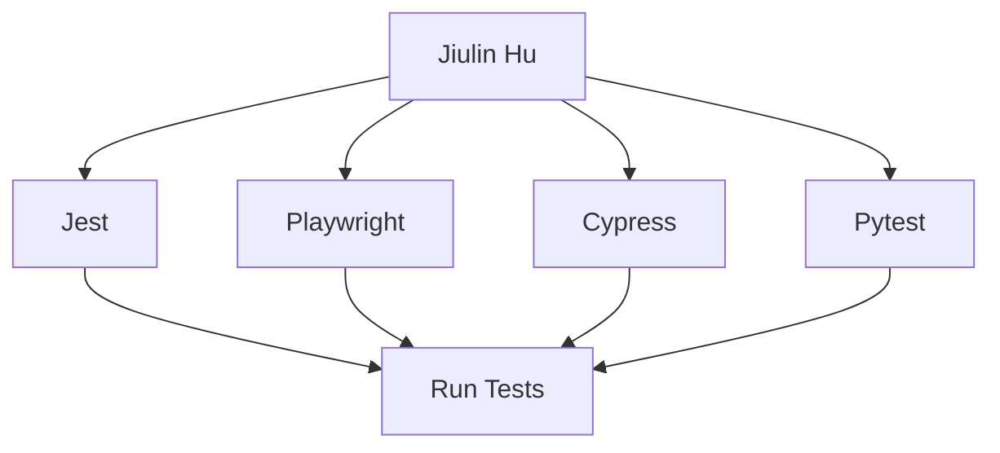

## Overview

Jiulin Hu empowers you to automate testing workflows efficiently. You create scripts for complex scenarios, integrate seamlessly with your CI/CD pipelines, and generate insightful reports. Supporting multiple frameworks, it handles both web and API testing with ease.

<Columns cols={3}>
  <Card title="Automated Scripting" icon="code" href="#automated-scripting">
    Write reusable test scripts that run across environments.
  </Card>
  <Card title="CI/CD Integration" icon="git-branch" href="#ci-cd-integration">
    Embed tests directly into your deployment pipelines.
  </Card>
  <Card title="Custom Reporting" icon="bar-chart-3" href="#custom-reporting">
    Tailor analytics to track key metrics and failures.
  </Card>
  <Card title="Framework Support" icon="layers" href="#framework-support">
    Works with Jest, Playwright, Cypress, and more.
  </Card>
  <Card title="Web & API Testing" icon="globe" href="#use-cases">
    Comprehensive coverage for frontend and backend validation.
  </Card>
</Columns>

## Automated Test Scripting

Build robust test scripts using Jiulin Hu's intuitive API. Define steps for user interactions, assertions, and data validation.

<CodeGroup tabs="JavaScript,Python">
  ```javascript
  import { test, expect } from 'jiulin-hu';

  test('User login flow', async ({ page }) => {
    await page.goto('https://dashboard.example.com/login');
    await page.fill('#email', 'user@example.com');
    await page.fill('#password', 'YOUR_PASSWORD');
    await page.click('button[type=submit]');
    await expect(page).toHaveURL(/dashboard/);
  });
  ```
  ```python
  from jiulin_hu import Test, expect

  test = Test('User login flow')

  async def run(page):
      await page.goto('https://dashboard.example.com/login')
      await page.fill('#email', 'user@example.com')
      await page.fill('#password', 'YOUR_PASSWORD')
      await page.click('button[type=submit]')
      expect(page).to_have_url('/dashboard')

  test.run(run)
  ```
</CodeGroup>

<Callout kind="tip">
  Store sensitive data like `YOUR_PASSWORD` in environment variables for security.
</Callout>

## CI/CD Integration

Integrate Jiulin Hu into your pipelines to run tests automatically on every commit.

<Steps>
  <Step title="Set up GitHub Actions" icon="github">
    Create `.github/workflows/test.yml` in your repo.
  </Step>
  <Step title="Configure Jiulin Hu" icon="settings">
    Add your `JIULIN_HU_TOKEN` as a secret.
  </Step>
  <Step title="Run Tests" icon="play">
````yaml
name: Test
on: [push]
jobs:
  test:
    runs-on: ubuntu-latest
    steps:
      - uses: actions/checkout@v4
      - run: npm install jiulin-hu
      - run: npx jiulin-hu run tests/
        env:
          JIULIN_HU_TOKEN: ${{ secrets.JIULIN_HU_TOKEN }}
````
  </Step>
  <Step title="Review Results" icon="check-circle">
    Check the workflow summary for pass/fail reports.
  </Step>
</Steps>

## Custom Reporting and Analytics

Customize reports to focus on metrics like failure rates and coverage.

<Tabs>
  <Tab title="HTML Report" icon="file-text">
    Generate interactive dashboards.
````html
<!DOCTYPE html>
<html>
<head><title>Test Report</title></head>
<body>
  <h1>Execution Summary</h1>
  <p>Passed: 45/50 | Failed: 5</p>
</body>
</html>
````
  </Tab>
  <Tab title="JSON Export" icon="database">
    Export data for integration with tools like Grafana.
````json
{
  "summary": {
    "passed": 45,
    "failed": 5,
    "duration": "120s"
  },
  "suites": [...]
}
````
  </Tab>
</Tabs>

## Framework Support

Jiulin Hu adapts to your preferred testing stack.



## Web and API Use Cases

Test end-to-end flows combining UI and backend validation.

<ParamField path="userId" param-type="string" required="true">
  Unique user identifier for API calls.
</ParamField>

<ParamField header="Authorization" param-type="string" required="true">
  Bearer `YOUR_TOKEN` for authenticated requests.
</ParamField>

<Request tabs="JavaScript,cURL">
  ```javascript
  const response = await fetch('https://api.example.com/users/{userId}', {
    headers: { Authorization: `Bearer ${YOUR_TOKEN}` }
  });
  ```
  ```bash
  curl -H "Authorization: Bearer YOUR_TOKEN" \
       https://api.example.com/users/{userId}
  ```
</Request>

<Response>
  ```json
  {
    "id": "123",
    "name": "Jane Doe",
    "email": "jane@example.com"
  }
  ```
</Response>

<Callout kind="success">
  Start with [Quickstart](/quickstart) to run your first test suite.
</Callout>